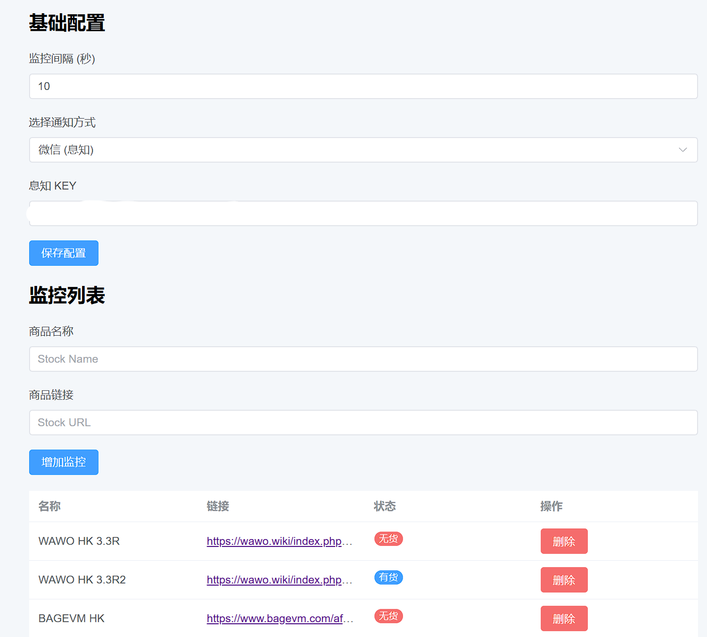

# VPS Stock Monitor

VPS Stock Monitor 是一个简单的库存监控工具，支持通过配置监控多个商品，并在库存状态变化时，通过 Telegram、微信或自定义 URL 通知用户。该工具提供了一个基于 Flask 的 Web 界面，用户可以通过浏览器轻松管理配置和监控项。



## 功能

- **库存监控**：支持监控多个商品的库存状态，支持判断商品是否有货。
- **通知方式选择**：可以选择通过 Telegram、微信或自定义 URL 发送库存变更通知。
- **Web 控制台**：基于 Flask 提供一个简单的 Web 控制台，用于添加、删除、暂停监控项和配置通知。
- **定时监控**：支持定时检查商品的库存状态，并在状态变化时发送通知。

## 限制

暂时只支持监控 WHMCS 模板的商家（以及其他一些商家），一次只能添加一个监控项（监控链接打开后需要有 Out Of Stock 或者缺货），不支持绕过 Cloudflare 盾或者人机验证

## 安装和配置

### Docker 安装

```
docker run -v ./vps-stock-monitor:/app/data -p 5000:5000 vpslog/vps-stock-monitor
```

访问 5000 端口进行设置即可。

### 1. 安装依赖

首先，克隆项目并进入项目目录：

```bash
https://github.com/vpslog/vps-stock-monitor/
cd vps-stock-monitor
```

然后安装项目依赖：

```bash
pip install -r requirements.txt
```

### 2. 启动应用

启动 Flask 应用：

```bash
python web.py
```

Flask 默认会在 `http://your-ip:5000/` 启动服务，您可以通过浏览器访问 Web 界面。将 `your-ip` 替换为您服务器的实际 IP 地址。

### 3. 使用 Web 界面

- 访问 `http://your-ip:5000/`，您将看到监控管理界面。
- **添加监控**：输入商品名称和商品 URL，点击 "增加监控" 来添加一个新的监控项。
- **删除监控**：点击 "删除" 按钮来移除商品监控。
- **更新配置**：修改配置项后，点击 "保存配置" 更新监控频率和通知设置。

### 4. 配置通知

您可以选择不同的通知方式：

- **Telegram**：提供 Telegram Bot Token 和 Chat ID，通过 Telegram 向指定的聊天发送库存变更通知。
- **微信**：提供息知 KEY，向指定用户发送通知（参考 [息知](https://xz.qqoq.net/#/index/)）。
- **自定义 URL**：提供一个自定义的通知 URL，`{message}` 参数将会替换为通知内容。

### 5. 监控过程

一旦监控启动，系统会定期检查商品 URL 中的库存信息。如果检测到库存状态变化，系统将通过所选的通知方式向用户发送通知。

---

## 项目结构

以下是项目的基本目录结构：

```
open-monitor/
│
├── README.md             # 项目说明文档
├── config.json           # 配置文件，包含监控和通知相关参数
├── core.py               # 核心逻辑处理，负责库存监控和通知发送
├── requirements.txt      # 项目依赖列表
├── templates/            # Flask 模板文件夹，存放前端页面
├── web.py                # Flask Web 应用，负责提供前端管理界面和 API 接口
└── __pycache__/          # Python 编译字节码缓存目录
```

## 更新日志

2024.11.12: 修复调节监控频率报错，规避线程冲突
